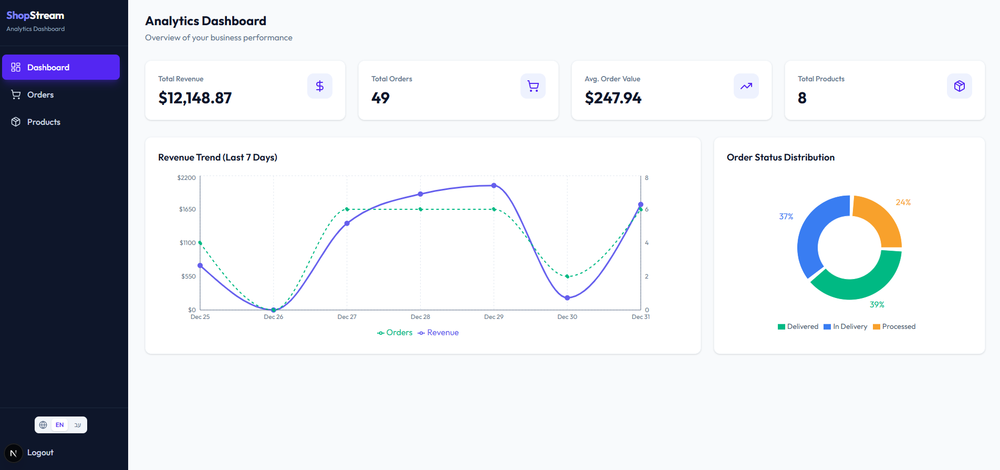

# ShopStream Dashboard

E-Commerce Analytics Dashboard - Full Stack Application

## Overview

ShopStream is an analytics dashboard for e-commerce operations teams to track revenue, monitor orders, and manage product catalog.

## Screenshots



## Tech Stack

| Layer | Technology |
|-------|------------|
| **Frontend** | Next.js 14, TypeScript, Tailwind CSS, Recharts |
| **Backend** | Hono, TypeScript, MongoDB |
| **Authentication** | JWT |
| **Testing** | Vitest, React Testing Library |

## Quick Start

### Prerequisites

- Node.js 18+
- MongoDB (local or Atlas)

### 1. Clone the Repository

```bash
git clone https://github.com/Rinahakim/shopstream-dashboard.git
cd shopstream-dashboard
```

### 2. Setup Backend

```bash
cd backend
npm install
cp .env.example .env
# Edit .env with your MongoDB connection string
npm run seed    # Seed database with demo data
npm run dev     # Starts on http://localhost:3000
```

### 3. Setup Frontend

```bash
cd frontend
npm install
cp .env.example .env.local
npm run dev     # Starts on http://localhost:3001
```

### 4. Access the App

Open http://localhost:3001

**Demo Credentials:**
- Username: `admin`
- Password: `admin123`

## Project Structure

```
shopstream-dashboard/
├── backend/          # Hono API server
│   ├── src/
│   │   ├── controllers/
│   │   ├── services/
│   │   ├── models/
│   │   └── routes/
│   └── README.md
├── frontend/         # Next.js application
│   ├── src/
│   │   ├── app/
│   │   ├── components/
│   │   ├── services/
│   │   └── hooks/
│   └── README.md
└── README.md         # This file
```

## Features

- **Authentication** - JWT-based login with protected routes
- **Dashboard** - Metric cards, revenue chart, order status pie chart
- **Orders** - Table with status filter and badges
- **Products** - Table with margin calculation and stock indicators
- **i18n** - English and Hebrew language support
- **Responsive** - Works on desktop and tablet

## API Documentation

See [backend/README.md](backend/README.md) for full API documentation.

## Architecture Decisions

1. **Service Layer Pattern** - Separates API calls from UI components
2. **React Query** - Server state with caching and loading states
3. **Zod Validation** - Type-safe form validation
4. **Custom Logger** - Structured logging with levels

## Testing

```bash
# Backend tests
cd backend && npm test

# Frontend tests
cd frontend && npm run test:run
```

## License

MIT
