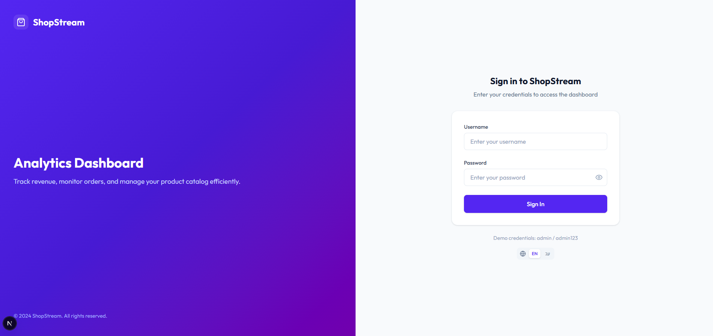
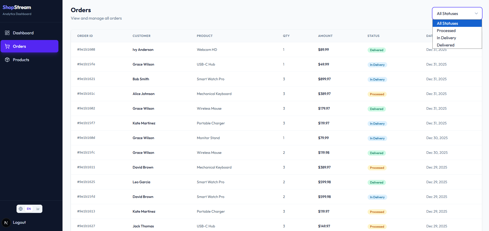
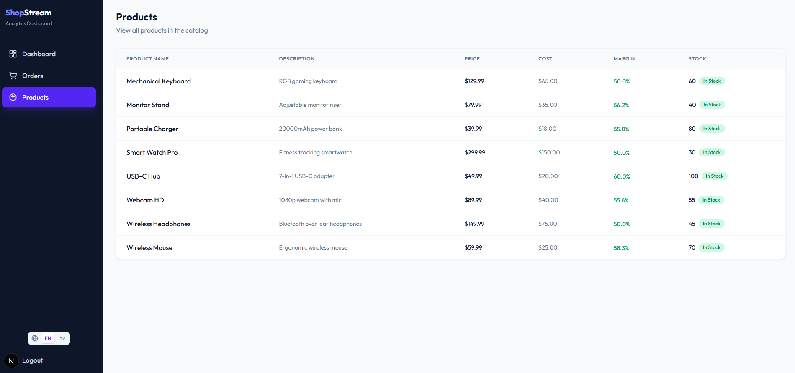

# ShopStream Dashboard - Frontend

E-Commerce Analytics Dashboard built with Next.js 14, TypeScript, and Tailwind CSS.

## Quick Start

```bash
# 1. Install dependencies
npm install

# 2. Create environment file
cp .env.example .env.local

# 3. Verify API URL in .env.local:
NEXT_PUBLIC_API_URL=http://localhost:3000

# 4. Start frontend (make sure backend is running first!)
npm run dev
```

**Login credentials:** `admin` / `admin123`

---

## Screenshots

### Login


### Dashboard


### Orders


### Products


## Tech Stack

| Category | Technology |
|----------|------------|
| Framework | Next.js 14 (App Router) |
| Language | TypeScript |
| Styling | Tailwind CSS |
| Charts | Recharts |
| State Management | TanStack Query |
| Forms | React Hook Form + Zod |
| i18n | next-intl (EN/HE) |
| Testing | Vitest + React Testing Library |

## Project Structure

```
src/
├── app/                    # Next.js App Router pages
│   ├── (auth)/login/       # Login page (public)
│   └── (protected)/        # Protected routes (dashboard, orders, products)
├── components/
│   ├── ui/                 # Reusable UI components
│   ├── charts/             # Chart components (Revenue, Order Status)
│   ├── layout/             # Sidebar, Header
│   └── forms/              # Form components
├── services/               # API service classes
├── hooks/                  # React Query hooks
├── lib/                    # Utilities (api-client, logger)
├── types/                  # TypeScript interfaces
├── context/                # React contexts (Auth)
├── i18n/                   # Translation files
└── __tests__/              # Test files
```

## Setup & Installation

### Prerequisites
- Node.js 18+
- npm
- Backend running on port 3000

### Installation

```bash
cd frontend
npm install
```

### Environment Variables

| Variable | Description | Default |
|----------|-------------|---------|
| `NEXT_PUBLIC_API_URL` | Backend API URL | `http://localhost:3000` |

## Development

```bash
# Start development server (port 3001)
npm run dev

# Run tests
npm run test

# Run tests once
npm run test:run

# Build for production
npm run build

# Lint code
npm run lint
```

## API Integration

The frontend connects to a backend API with the following endpoints:

| Endpoint | Method | Description |
|----------|--------|-------------|
| `/auth/login` | POST | Authenticate user |
| `/analytics/metrics` | GET | Dashboard summary cards |
| `/analytics/revenue-trend` | GET | Revenue chart data (7 days) |
| `/analytics/order-status` | GET | Order status distribution |
| `/orders` | GET | List orders (with optional status filter) |
| `/products` | GET | List products |

## Features

### Authentication
- JWT-based authentication
- Protected routes with automatic redirect
- Token stored in localStorage
- Session expiration handling

### Dashboard
- Metric cards (Revenue, Orders, AOV, Products)
- Revenue trend line chart (7 days)
- Order status pie chart
- Loading skeletons

### Orders
- Sortable table with status badges
- Filter by status (Processed, In Delivery, Delivered)
- Responsive design

### Products
- Product table with margin calculation
- Stock status indicators
- Price and cost display

## Testing

```bash
# Run all tests
npm run test:run

# Run tests in watch mode
npm run test

# Run with coverage
npm run test:coverage
```

### Test Coverage
- **Services**: AuthService, AnalyticsService, OrdersService, ProductsService
- **Components**: Button, MetricCard
- **Integration**: Auth flow (login form validation and submission)
- **Utilities**: cn, formatCurrency, formatDate

## Architecture Decisions

1. **Service Layer Pattern**: API calls are abstracted into service classes for reusability and testability
2. **React Query**: Server state management with built-in caching, loading states, and error handling
3. **Custom Logger**: Structured logging with levels (debug, info, warn, error)
4. **i18n Ready**: All user-facing text uses translation keys (English and Hebrew)

## Demo Credentials

```
Username: admin
Password: admin123
```
